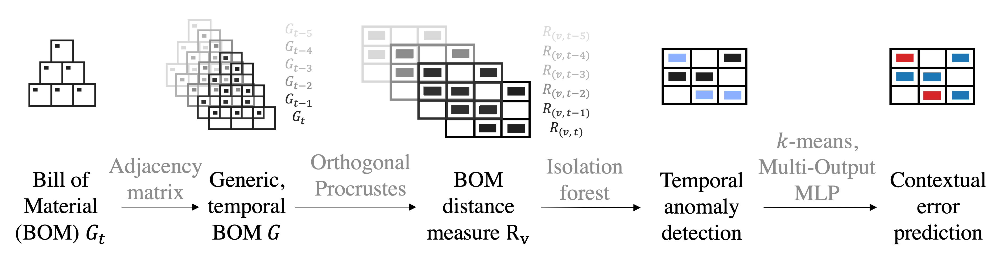
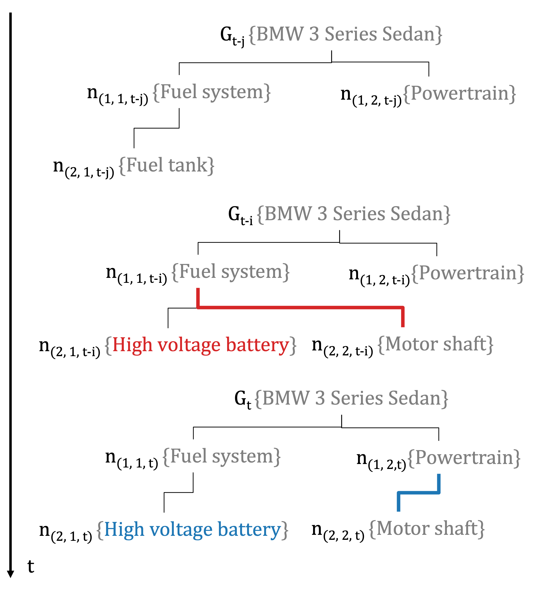
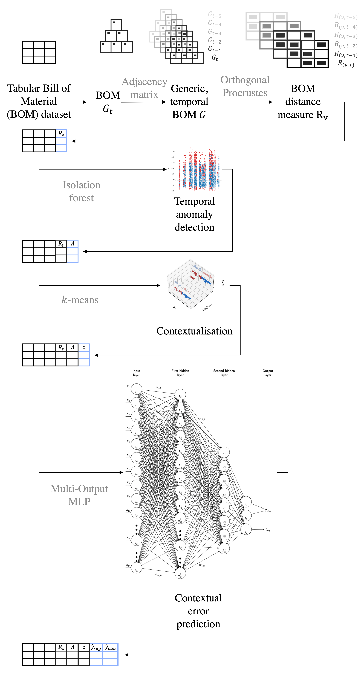
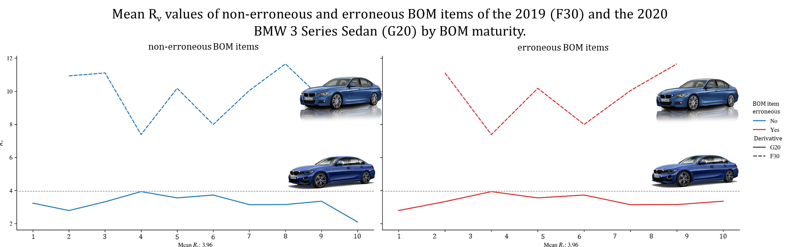
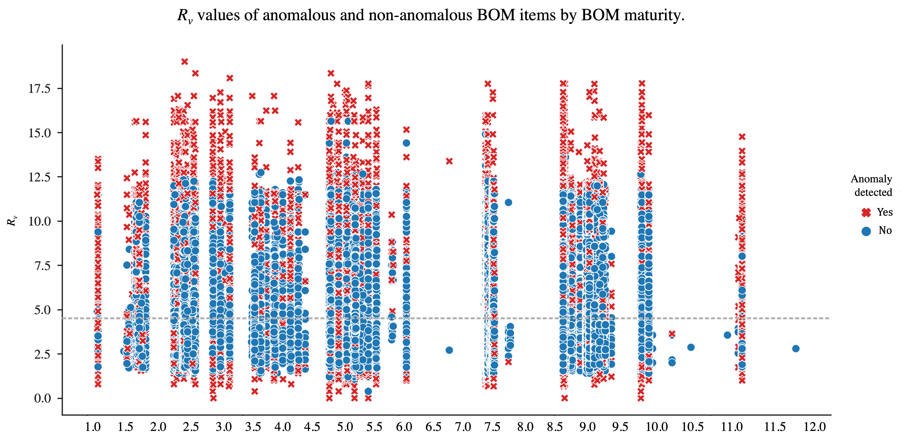

<br />
<div align="center">
  <a>
    
  </a>

  <h3 align="center">Orthogonal Procrustes and Machine Learning: Predicting Errors on Time</h3>

  <p align="center">
    This is the Python repository for the Machine Learning pipeline proposed in our paper.
    <br />
    <a href="https://papers.ssrn.com/sol3/papers.cfm?abstract_id=4251153"><strong>Check the preprint »</strong></a>
    <br />
    <br />
  </p>
</div>


<!-- TABLE OF CONTENTS -->
<details>
  <summary>Table of Contents</summary>
  <ol>
    <li>
      <a href="#about-the-project">About The Project</a>
      <ul>
        <li><a href="#built-with">Built With</a></li>
      </ul>
    </li>
    <li>
      <a href="#getting-started">Getting Started</a>
      <ul>
        <li><a href="#prerequisites">Prerequisites</a></li>
        <li><a href="#installation">Installation</a></li>
      </ul>
    </li>
    <li><a href="#usage">Usage</a></li>
    <li><a href="#roadmap">Roadmap</a></li>
    <li><a href="#contributing">Contributing</a></li>
    <li><a href="#license">License</a></li>
    <li><a href="#contact">Contact</a></li>
    <li><a href="#acknowledgments">Acknowledgments</a></li>
  </ol>
</details>


<!-- The pipeline -->
## Motivation
In an industrial product development process, the Bill of Material (BOM) is a hierarchical, 
multi-level representation of all components, parts and quantities of a product. 
With increasing complexity of industrial products, also BOMs become more complex 
and thus prone to errors, for example when the individual parts of a product are changed 
during the product development process. Frequently, these BOM errors have to be 
identified manually or by using simple, rule-based schemes.




We provide an answer to the main question of how to represent a BOM for Machine Learning (ML) 
tasks by solving the orthogonal Procrustes problem for dynamic, hierarchical datasets. 
Then, we describe an isolation forest based approach to temporal anomaly detection, 
which points at potential errors in a BOM at a specific timestamp. 
Furthermore, we apply ML and present a multi-output Multi-Layer Perceptron (MLP) for the prediction 
of temporal BOM errors. The model predicts where and at which point of time 
BOM errors are probable to occur, which renders it a prescriptive system. 
Eventually, we optimise the performance of our model using contextualization via k-means clustering.



Some information on the dataset:
* The dataset contains about 350k real-world, anonymized parts from BOMS of the automotive industry.
* Together with the indicators `component` and `part`, five different features as well as an indicator for `erroneous` parts are included.
* The dataset will be filtered, in order to achieve manageable computation times. If you don't want that, set `SAMPLE = False` in `constants`

<p align="right">(<a href="#readme-top">back to top</a>)</p>


<!-- GETTING STARTED -->
## Getting Started

There are no prerequisites, every library required is in the virtual environment.

### Starting the pipeline

The pipeline starts with:
  ```sh
  if __name__ == '__main__':
    main()
  ```

<p align="right">(<a href="#readme-top">back to top</a>)</p>

Please note that there exist more Python files than called in the `main`, such as `benchmark clustering`.
The reason for this is, that extensive benchmark activities were undertaken but are nor relevant for
the paper anymore. For the sake of completion, the files were added.

<!-- Figures -->
## Figures

Lines of code that print figures or LaTeX tables were disabled in this repo for time optimization.
Here are some of the most relevant figures:

Mean R_v values of erroneous parts in red and non-erroneous parts in blue of two vehicle generations (BMW 3 Series from 2019, referred to as F30 and BMW 3 Series Sedan of 2020, referred to as G20) by timestamp. 
The timestamp reflects a BOM maturity phase in the product development process. The figure displays that mean R_v experience a shift from vehicle generation to vehicle generation.


A critical question is whether parts that are integrated into the BOM later than initially planned (delayed parts) are more prone to errors and if this can be indicated by R_v.
This figure reflects that R_v differs only marginally and that it solely cannot be seen as a good indicator for erroneous parts.


The isolation forest anomaly detection results with R_v mean as dotted line. In contrast to the figure above 
anomalies can now be detected in parts, where no significant deviation of R_v from its mean is visible.


_For detailed explanations of the figures, please refer to the [our prepring](https://papers.ssrn.com/sol3/papers.cfm?abstract_id=4251153)_

<p align="right">(<a href="#readme-top">back to top</a>)</p>

<!-- LICENSE -->
## License

Distributed under the MIT License. See `LICENSE.txt` for more information.

<p align="right">(<a href="#readme-top">back to top</a>)</p>

<!-- ACKNOWLEDGMENTS -->
## Acknowledgments

We were provided with real world Bill of Material data from the BMW Group for this project. 
[BMW Group](https://www.bmw.com/en/index.html)
